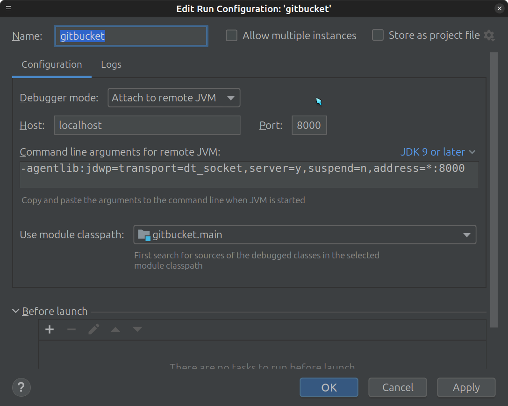

Debug GitBucket on IntelliJ
========

Remote debug flags (`-Xdebug`, `-Xrunjdwp`) are already configured in
`build.sbt` `Container / javaOptions`. No manual build.sbt setup needed.

## Start GitBucket

```shell
./sbt "~Container / start"
```

Wait for `Listening for transport dt_socket at address: 8000` to appear.

## Attach Debugger

In IntelliJ, create remote debug configuration as follows:

1. **Run** → **Edit Configurations…**
2. Click **+** → **Remote JVM Debug**
3. Set **Host** = `localhost`, **Port** = `8000`
4. Set **Search sources using module's classpath** = `gitbucket.main`
5. Click **OK**, then click the Debug icon to attach



Set a breakpoint (e.g., line 83 in `src/main/scala/gitbucket/core/controller/ApiController.scala`), then trigger the endpoint:

```shell
curl http://localhost:8080/api/v3
```

## Troubleshooting

### Breakpoint hits but "frames are not available"

IntelliJ's source mapping is out of sync. Fix:

1. **File** → **Invalidate Caches…** → **Invalidate and Restart**
2. After restart, wait for sbt import to complete
3. Re-run `./sbt "~Container / start"`
4. Re-attach debugger

May need to disconnect/reconnect debugger 1-2 times for frames to appear.

### Port 8000 already in use

A previous debug session didn't clean up. Kill the process:

```shell
lsof -ti:8000 | xargs kill -9
```

Then restart sbt.

### Breakpoint doesn't hit

Ensure code was compiled **after** debugger attached. Edit the source file (add/remove a blank line) to trigger recompilation, then retry the request.

### Disable remote debugging

Remote debug flags are always present in `build.sbt` `Container / javaOptions`.
To disable, comment out the `-Xdebug` and `-Xrunjdwp` lines there and restart sbt.
