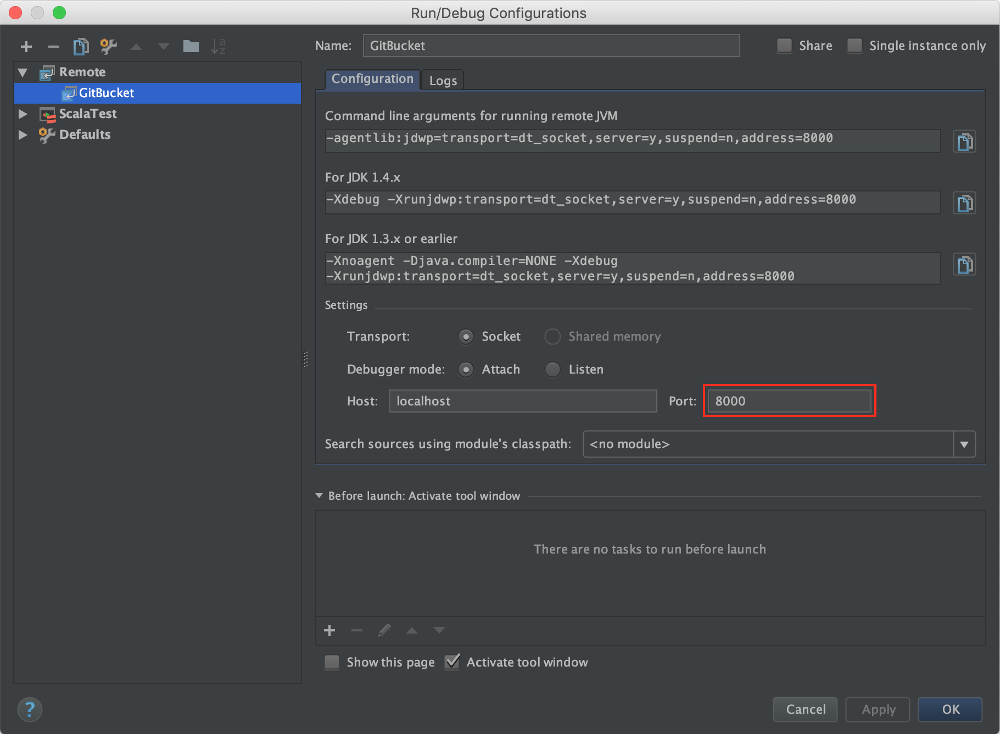

Debug GitBucket on IntelliJ
========
Add following configuration for allowing remote debugging to `buils.sbt`:

```scala
javaOptions in Jetty ++= Seq(
  "-Xdebug",
  "-Xrunjdwp:transport=dt_socket,server=y,suspend=n,address=8000"
)
```

Run GitBucket:

```shell
$ sbt ~jetty:start
```

In IntelliJ, create remote debug configuration as follows. Make sure port number is same as above configuration.



Then you can start debugging on IntelliJ!
